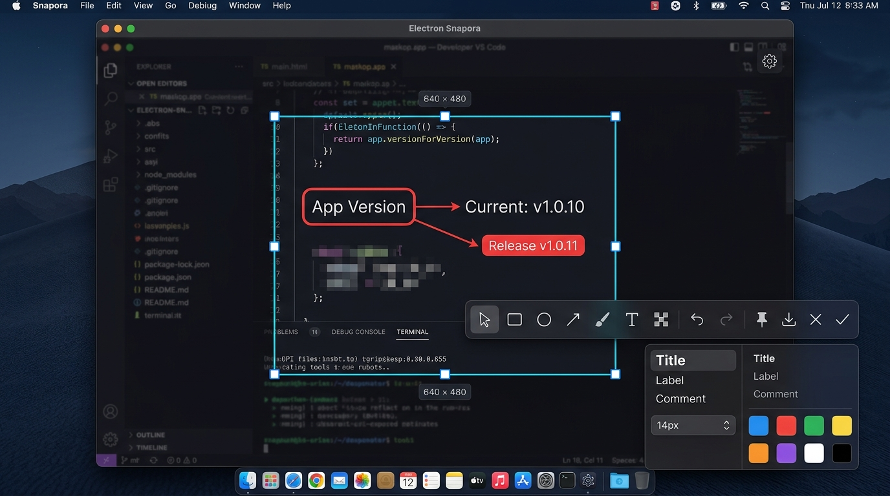

# electron-snapora — Electron向けスクリーンショット・注釈ツール

[](https://www.npmjs.com/package/electron-snapora)
[](https://www.npmjs.com/package/electron-snapora)
[](https://www.npmjs.com/package/electron-snapora)
[](https://github.com/electron-tools/electron-snapora/actions)
[](https://www.electronjs.org)
[](https://www.typescriptlang.org/)
[](https://github.com/electron-tools/electron-snapora)
[](https://github.com/electron-tools/electron-snapora/blob/main/LICENSE)
[](https://github.com/electron-tools/electron-snapora/stargazers)

[English](https://github.com/electron-tools/electron-snapora/blob/main/README.md) | [简体中文](https://github.com/electron-tools/electron-snapora/blob/main/README.zh-CN.md) | 日本語 | [한국어](https://github.com/electron-tools/electron-snapora/blob/main/README.ko.md) | [Español](https://github.com/electron-tools/electron-snapora/blob/main/README.es.md)

Electronアプリに範囲キャプチャ、インタラクティブな選択、画像注釈、クリップボードへのコピー、PNG保存を追加します。

<p align="center">
  
</p>

## 機能

- 矩形範囲のキャプチャとインタラクティブなオーバーレイ。
- 四角形、楕円、矢印、ブラシ、テキスト、強度調整可能なモザイク、ウォーターマーク注釈。
- 元に戻す、やり直し、クリップボードへのコピー、ネイティブPNG保存、画面への固定。
- TypeScript、ESM、CommonJSをサポート。
- ネイティブアドオンやインストール後のコンパイルは不要。

## クイックスタート

要件：Node.js 20以降、Electron 42以降。

### 1. インストール

```bash
npm install electron-snapora
```

本パッケージは本番用の `dependencies` に含めてください。

### 2. メインプロセスを設定

```ts
import { app, BrowserWindow, ipcMain } from 'electron';
import { setupElectronSnapora } from 'electron-snapora/main';

app.whenReady().then(() => {
  const snapora = setupElectronSnapora({ ipcMain });
  const mainWindow = new BrowserWindow({
    webPreferences: {
      preload: snapora.preloadPath,
      contextIsolation: true,
      sandbox: true,
    },
  });

  mainWindow.loadFile('index.html');
  app.once('before-quit', snapora.unregister);
});
```

### 3. Rendererからキャプチャ

```ts
const result = await window.electronSnapora.capture({ display: 'cursor' });

if (result.status === 'completed') {
  console.log(result.data, result.bounds, result.output);
}
```

`result.data` はPNGのバイトデータです。キャンセル時は `cancelled`、失敗時は `failed` が返ります。

## 既存のPreloadを使用する場合

アプリ独自のPreloadからAPIを公開し、そのPreloadをホスト側のビルドツールでバンドルしてください。

```ts
import { contextBridge, ipcRenderer } from 'electron';
import { exposeScreenshotApi } from 'electron-snapora/preload';

exposeScreenshotApi({ contextBridge, ipcRenderer });
```

## パッケージング

Electronのメインプロセスをバンドルする際は `electron-snapora` をexternalにし、本番用依存関係に含めてください。これによりOverlayのHTML、CSS、Preloadファイルがアプリに同梱されます。

テーマ、ローカライズ、IPC送信元の検証、同時実行キュー、診断、各種バンドラー設定については[英語の完全版ドキュメント](https://github.com/electron-tools/electron-snapora/blob/main/README.md)を参照してください。

リポジトリ：[github.com/electron-tools/electron-snapora](https://github.com/electron-tools/electron-snapora)

ライセンス：[MIT](https://github.com/electron-tools/electron-snapora/blob/main/LICENSE)
