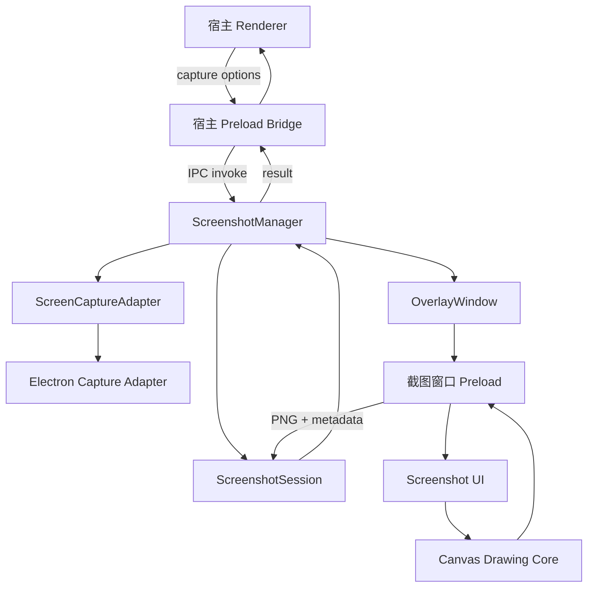
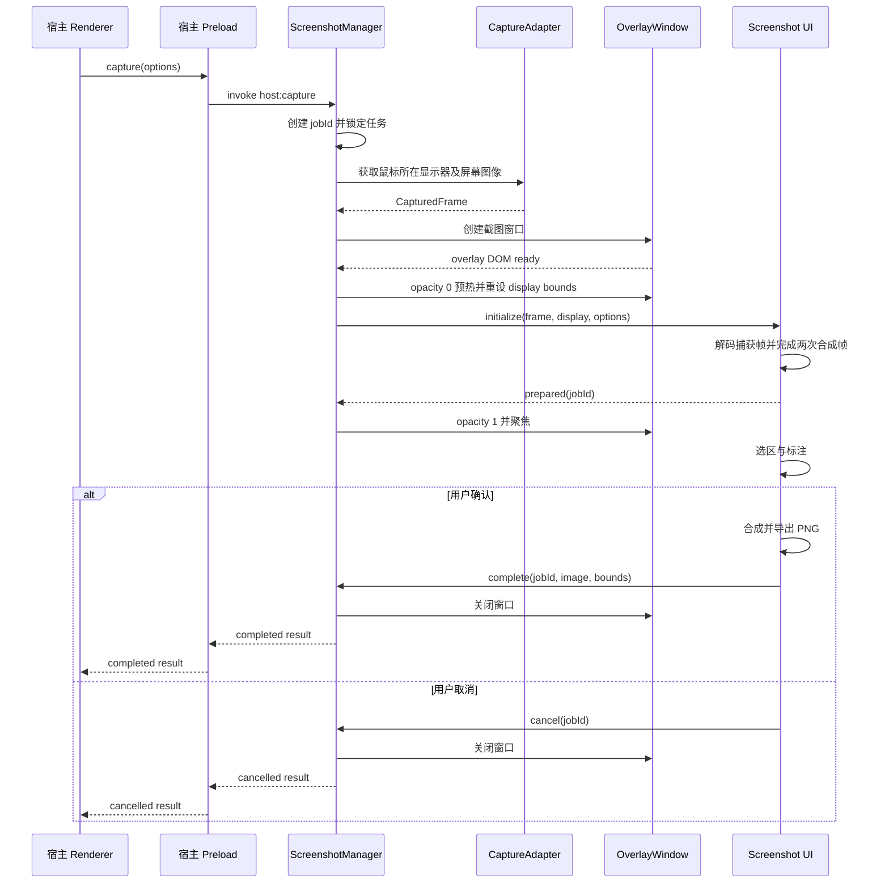

# Electron Snapora 通用截图工具实现方案

参考：https://cleanshot.com/

> 状态：Draft
> 目标：为 Electron 应用提供低配置、低版本耦合、可扩展的屏幕截图与标注能力。

## 1. 建设目标

工具需要满足以下核心目标：

- Electron 应用只需完成主进程注册、Preload 暴露和 Renderer 调用即可接入。
- 默认不依赖原生 Node 扩展，不需要 `node-gyp`、额外可执行文件或安装后编译。
- 绘制核心使用纯 TypeScript 和 Canvas，不直接依赖 Electron。
- 截图界面运行在独立窗口中，不绑定宿主应用的 React、Vue 等前端框架版本。
- 支持区域选择、基础标注、撤销重做和 PNG 输出。
- 将 Electron 相关能力收敛在适配层，避免上层代码依赖具体 Electron 版本。
- 公共 API 只负责截图，不绑定上传、消息、文件管理等业务逻辑。

第一阶段不包含以下能力：

- OCR、长截图、录屏和贴图。
- 自动识别所有外部窗口边界。
- 跨多个显示器连续框选一个区域。
- 强制接管宿主应用的全局快捷键。
- 内置上传或业务消息发送。

## 2. 核心设计原则

### 2.1 核心与运行环境解耦

绘制引擎只处理图片、坐标、图形元素和输出，不引用 `electron`、Node.js 文件系统或宿主框架。

### 2.2 UI 独立运行

截图 UI 由 npm 包自行构建并随包发布，在独立 `BrowserWindow` 中运行。宿主应用不需要把截图组件挂载进自身组件树。

### 2.3 Electron 适配层保持轻量

Electron 层只负责：

- 获取显示器信息。
- 获取屏幕图像。
- 创建和销毁截图窗口。
- 处理系统权限。
- 转发强类型 IPC 消息。
- 管理一次截图任务的生命周期。

### 2.4 默认使用稳定 API

- 使用 `BrowserWindow`，不使用已废弃的 `BrowserView`。
- 使用 `desktopCapturer`、`screen`、`nativeImage`、`ipcMain` 和 `ipcRenderer`。
- 使用能力检测处理差异，不根据 Electron 版本号堆叠条件分支。
- Electron 作为 `peerDependency`，不随截图包重复安装。

### 2.5 安全优先

- 截图窗口保持 `nodeIntegration: false`。
- 开启 `contextIsolation` 和 `sandbox`。
- Preload 只暴露固定方法，不暴露通用 IPC 调用器。
- 主进程校验任务 ID、消息来源、选区范围和输出大小。

## 3. 总体架构



各层职责：

| 层级                 | 职责                                           |
| -------------------- | ---------------------------------------------- |
| 宿主 Renderer        | 展示截图入口，调用截图 API，消费截图结果       |
| 宿主 Preload         | 将有限的截图能力安全暴露给宿主页面             |
| ScreenshotManager    | 统一入口、并发控制、任务创建、结果返回         |
| ScreenCaptureAdapter | 抽象屏幕获取能力，隔离 Electron 或未来原生实现 |
| ScreenshotSession    | 管理单次任务状态、资源和 Promise               |
| OverlayWindow        | 创建包内部截图窗口并负责窗口生命周期           |
| 截图窗口 Preload     | 为内部 UI 提供严格限定的通信协议               |
| Screenshot UI        | 工具栏、选区、控制点、提示、快捷键和用户交互   |
| Canvas Drawing Core  | 几何计算、图形模型、绘制、历史记录和最终导出   |

## 4. 推荐代码结构

对外先发布一个 npm 包，通过子路径区分不同运行环境：

```text
electron-snapora/
├─ src/
│  ├─ core/
│  │  ├─ model/
│  │  │  ├─ document.ts
│  │  │  ├─ element.ts
│  │  │  └─ selection.ts
│  │  ├─ geometry/
│  │  │  ├─ coordinate-transform.ts
│  │  │  ├─ hit-test.ts
│  │  │  ├─ resize.ts
│  │  │  └─ clamp.ts
│  │  ├─ history/
│  │  │  ├─ command.ts
│  │  │  └─ command-stack.ts
│  │  ├─ render/
│  │  │  ├─ background-renderer.ts
│  │  │  ├─ annotation-renderer.ts
│  │  │  ├─ mosaic-renderer.ts
│  │  │  └─ export-renderer.ts
│  │  └─ tools/
│  │     ├─ select-tool.ts
│  │     ├─ rectangle-tool.ts
│  │     ├─ ellipse-tool.ts
│  │     ├─ arrow-tool.ts
│  │     ├─ brush-tool.ts
│  │     ├─ text-tool.ts
│  │     └─ mosaic-tool.ts
│  ├─ overlay/
│  │  ├─ index.html
│  │  ├─ main.ts
│  │  ├─ styles.css
│  │  ├─ canvas/
│  │  ├─ toolbar/
│  │  ├─ theme/
│  │  └─ i18n/
│  ├─ electron/
│  │  ├─ main/
│  │  │  ├─ ScreenshotManager.ts
│  │  │  ├─ ScreenshotSession.ts
│  │  │  ├─ ElectronCaptureAdapter.ts
│  │  │  ├─ OverlayWindow.ts
│  │  │  ├─ PermissionService.ts
│  │  │  └─ register-host-ipc.ts
│  │  ├─ preload/
│  │  │  ├─ host-preload.ts
│  │  │  └─ overlay-preload.ts
│  │  └─ protocol/
│  │     ├─ channels.ts
│  │     ├─ messages.ts
│  │     └─ validators.ts
│  ├─ main.ts
│  ├─ preload.ts
│  ├─ core.ts
│  └─ types.ts
├─ demo/
├─ package.json
└─ vite.config.ts
```

建议的发布结构：

```text
dist/
├─ main/
│  ├─ index.cjs
│  └─ index.mjs
├─ preload/
│  ├─ index.cjs
│  └─ index.mjs
├─ core/
│  ├─ index.cjs
│  └─ index.mjs
├─ overlay/
│  ├─ index.html
│  ├─ preload.cjs
│  ├─ preload.mjs
│  └─ assets/
└─ types/
```

## 5. 单次截图运行流程

任务状态机：

```text
idle
  → capturing
  → opening-overlay
  → preparing-overlay
  → editing
  → exporting
  → completed | cancelled | failed
```

完整时序：



必须先捕获屏幕，再创建隐藏的遮罩窗口。Windows 和 macOS 在 Overlay DOM 就绪后先以 0 透明度调用 `showInactive()`，让窗口不可见地进入桌面合成器；Windows 随即再次应用完整显示器 `bounds`，避免系统首次显示时将无边框窗口压缩到不含任务栏的 `workArea`。预热和正式显现阶段都调用 `setAlwaysOnTop(true, 'screen-saver')`，显现后再调用 `moveTop()` 刷新原生 Z 序，确保截图层高于普通窗口及其他默认置顶窗口；Linux 保留标准 `alwaysOnTop` 并允许窗口管理器自然降级。Renderer 收到静态捕获帧后完成图片解码、Canvas 尺寸同步和连续两次合成帧，再发送 `prepared(jobId)`。每次合成帧同时设置 60ms 超时兜底，防止透明、未聚焦窗口中的 `requestAnimationFrame` 被系统节流后长期不显示。主进程校验消息来源和任务 ID 后将透明度切为 1 并聚焦，既避免截图控件进入最终图片，也避免纹理分块、重复任务栏和画面向上压缩。

## 6. 屏幕捕获抽象

核心捕获接口：

```ts
export interface ScreenCaptureAdapter {
  getDisplays(): Promise<CaptureDisplay[]>;

  getCursorDisplay(): Promise<CaptureDisplay>;

  captureDisplay(displayId: string): Promise<CapturedFrame>;
}

export interface CaptureDisplay {
  id: string;
  bounds: {
    x: number;
    y: number;
    width: number;
    height: number;
  };
  scaleFactor: number;
  isPrimary: boolean;
}

export interface CapturedFrame {
  display: CaptureDisplay;
  data: Uint8Array;
  mimeType: 'image/png';
  pixelSize: {
    width: number;
    height: number;
  };
}
```

默认 `ElectronCaptureAdapter` 使用：

- `screen.getCursorScreenPoint()` 获取鼠标位置。
- `screen.getDisplayNearestPoint()` 确定目标显示器。
- `desktopCapturer.getSources()` 获取屏幕图像。
- `DesktopCapturerSource.display_id` 匹配显示器。
- `nativeImage.toPNG()` 转换图片数据。

如果未来需要原生窗口识别、更高性能捕获或特殊平台支持，只需增加新的 Adapter，不修改 UI 和绘制核心。

## 7. DPI 与坐标系统

工具需要同时维护三套坐标：

| 坐标空间           | 用途                            |
| ------------------ | ------------------------------- |
| Screen DIP         | Electron 窗口位置和显示器边界   |
| Viewport CSS Pixel | Pointer Event、工具栏和选区交互 |
| Image Pixel        | 图形模型和最终图片导出          |

图形元素统一存储为图片像素坐标。UI 事件通过坐标转换器映射：

```ts
scaleX = capturedImageWidth / viewportWidth;
scaleY = capturedImageHeight / viewportHeight;

imageX = viewportX * scaleX;
imageY = viewportY * scaleY;
```

不能只假设 `scaleX === scaleFactor`。应始终根据实际捕获图片尺寸计算缩放比例，以处理平台差异和非整数 DPI。

## 8. 截图窗口设计

建议窗口配置：

```ts
const overlayWindow = new BrowserWindow({
  x: display.bounds.x,
  y: display.bounds.y,
  width: display.bounds.width,
  height: display.bounds.height,
  useContentSize: true,
  frame: false,
  hasShadow: false,
  resizable: false,
  movable: false,
  minimizable: false,
  maximizable: false,
  skipTaskbar: true,
  show: false,
  alwaysOnTop: true,
  opacity: supportsInvisiblePriming ? 0 : 1,
  paintWhenInitiallyHidden: true,
  webPreferences: {
    preload: overlayPreloadPath,
    nodeIntegration: false,
    contextIsolation: true,
    sandbox: true,
  },
});
```

窗口行为要求：

- 页面和图片准备完成后再显示，避免白屏闪烁。
- Windows/macOS 先透明预热；Windows 在预热后重新设置完整显示器 `bounds`，不能用 `workArea` 作为截图窗口内容尺寸。
- `Escape` 取消，`Enter` 确认。
- 同时只允许一个活动截图任务。
- 截图结束后恢复之前聚焦的宿主窗口。
- 窗口异常关闭必须将任务结算为 `cancelled` 或 `failed`。
- 第一阶段只在鼠标所在显示器创建一个截图窗口。

截图窗口直接显示已捕获的静态画面，不依赖透明窗口持续透出实时桌面。窗口使用显示器 DIP 边界和精确内容尺寸，捕获帧则按真实像素尺寸映射；这样可以避免桌面内容变化、工具栏被捕获、窗口阴影边界和不同平台透明合成差异。

## 9. UI 与 Canvas 绘制架构

推荐三层视觉结构：

```text
Interaction Layer
  ├─ 选区框
  ├─ 八方向控制点
  ├─ 工具栏
  ├─ 尺寸提示
  └─ 放大镜

Annotation Canvas
  ├─ 箭头
  ├─ 矩形/椭圆
  ├─ 画笔
  ├─ 文字
  └─ 马赛克

Background Canvas
  └─ 原始屏幕图像
```

交互层不进入最终图片。导出时创建独立的离屏 Canvas：

```text
原始图片
  → 按选区裁剪
  → 按图片像素坐标绘制标注元素
  → 输出 PNG Blob
  → 转换为 Uint8Array
```

### 9.1 M2 落地结构

区域选择阶段按下面的单向数据流实现：

```text
Pointer / Keyboard Event
  → OverlayAction
  → reduceOverlayState
  → OverlayState
  → DOM Render
  → Confirm 时坐标换算与离屏 Canvas 导出
```

- `selection-store.ts` 只通过 Action 改变等待、框选、移动、缩放、已选择和导出状态。
- `selection-geometry.ts` 提供反向拖拽归一化、边界限制、八方向缩放、工具栏避让和三套坐标换算纯函数。
- `export-selection.ts` 优先使用 `OffscreenCanvas`，并为较早的 Chromium 运行时保留未挂载 DOM Canvas 回退。
- Viewport 到 Image 的换算以捕获帧实际尺寸为准；左上边缘向下取整，右下边缘向上取整，避免非整数 DPI 丢失边缘像素。
- 动态选区位置通过 CSS 属性写入，因此 Overlay 的 CSP 仅对样式允许内联值；脚本仍严格限制为包内资源。

### 9.2 M3 标注与输出操作

标注模型使用 Image Pixel 坐标并保持纯数据结构，所有新增、更新和删除都通过命令历史执行：

```text
Pointer / Text Input
  → Annotation Draft
  → Add / Update / Remove Command
  → ScreenshotDocument
  → Annotation Canvas Preview
  → Offscreen Canvas Final Composition
```

- 支持矩形、椭圆、箭头、画笔、文字和马赛克六类元素。
- 选择工具提供命中检测、移动、八方向缩放和删除；所有提交操作支持撤销、重做。
- 颜色、线宽、字号和文字布局指标存入元素本身，保证文档可序列化和重放；马赛克块大小属于渲染常量，不进入元素模型。
- 样式控件既更新后续绘制的默认值，也更新当前选中元素；对已选元素的修改通过 `UpdateElementCommand` 进入撤销、重做历史。
- 文字编辑器保持 Canvas `pointerdown` 后的输入焦点，`Shift + Enter` 创建多行，`Enter` 提交；点击另一个 Canvas 区域时必须先提交当前 textarea，再清空并打开下一次输入，避免复用输入框导致未回车内容丢失。文字提交后默认不选中，只有切换到选择工具并再次点击文字才显示 resize 控制点。输入框、预览、命中边界和最终 PNG 使用相同的字体与 1.3 倍多行行高。提交时将 textarea 的边框、内边距及行框半行留白按当前 DPI 换算为 Image Pixel，并使用同字体的 `fontBoundingBoxAscent/Descent` 计算 Canvas 首行基线；字体框指标不可用时再回退到实际字形指标，使 Windows 等平台确认前后的文字保持原位。文字提交时通过 Canvas `measureText()` 记录实际宽度、上升部和下降部，中文全角字符、英文及混排文字都以真实布局指标计算选中框，字号调整和缩放时同步按比例更新指标。
- 颜色控件在全部工具状态下常显，位于第二个标注工具分栏的第一位；历史与属性面板始终只展示当前有效的线宽或字号控件，不保留无意义空位。
- 马赛克采用 Lark 风格的框选区域：拖动时实时渲染矩形马赛克，并叠加 24% 蓝色底纹、深色外描边和亮蓝虚线内描边，在明暗或复杂背景上都能清楚识别范围，但不显示控制点；松开后取消临时反馈，切换到选择工具并点击区域时才显示八方向控制点，随后可拖拽或缩放。像素块固定为 8 Image Pixel，不提供 size 控件；渲染时将网格对齐到原图，只截取框选周边缩小并使用高质量平均色，再关闭平滑放大，避免整屏单点降采样产生大块纯白或纯灰。底纹、边框和控制点都属于交互反馈，不进入最终 PNG。
- 文字编辑器根据 `scrollHeight` 自动增长并隐藏滚动区域，输入期间不出现内部滚动条。
- 预览 Canvas 使用捕获帧真实像素尺寸，最终导出时重新在独立 Canvas 上裁剪背景并绘制标注，选区边框、控制点和工具栏不会进入 PNG。
- 自由画笔使用笔刷语义图标，笔迹提交后直接取消选中，不显示与连续笔迹编辑方式不匹配的缩放边框；用户仍可切换选择工具后重新命中和移动笔迹。

保存与复制通过单独的主进程输出通道完成：

```text
Overlay 合成 PNG
  → invoke(output: save | copy)
  → OutputRouter 校验 protocolVersion / jobId / sender
  ├─ save → showSaveDialog → writeFile
  └─ copy → nativeImage.createFromBuffer → clipboard.writeImage
  → 成功后 confirm 并统一释放截图会话
```

保存对话框取消时返回 Overlay，不丢失选区和标注；输出失败显示错误并允许重试。蓝色确认按钮、`Enter` 和 `Ctrl/Command + C` 统一执行复制后完成：主进程成功写入系统剪贴板后，Overlay 才向宿主返回 PNG 并关闭。文件系统、系统对话框和剪贴板对象始终只存在于主进程。

### 9.3 Overlay 视觉与工具提示

Overlay 使用接近原生截图工具的紧凑悬浮布局，视觉层不依赖宿主应用组件库：

```text
选择工具面板
  + 标注工具分段面板（颜色控件位于首位）
  + 历史与样式面板
  + 保存 / 取消 / 复制完成面板
```

- 每个面板使用统一高度、灰色半透明表面和轻量阴影；当前工具只使用一个强调色表达激活状态。
- 颜色控件位于第二个标注分栏首位；历史与属性区只保留有效控件，并通过稳定分组宽度避免切换工具时产生误触。
- 文字输入态只显示白色细边框，背景保持透明，不使用蓝色边框或深色底板遮挡截图内容。
- 标注工具面板与输出操作面板共用同一组图标间距和水平内边距 Token，不让工具按钮贴边或互相粘连。
- 图标通过包内 SVG Sprite 提供，不加载网络资源、字体图标或第三方品牌素材。
- 工具名称和快捷键通过延迟出现的气泡展示；气泡根据工具栏位于选区上方或下方自动改变方向。
- 中文和英文的工具名、状态、样式名、输出操作及无障碍标签由 Overlay 自身本地化，不依赖宿主翻译系统；宿主可按字段覆盖文案。
- `V/R/O/A/P/T/M` 切换工具，`Ctrl/Command + C` 或 `Enter` 复制并完成，`Ctrl/Command + S` 保存，`Escape` 取消；按钮保留键盘焦点态和 `aria-label`。
- 主题使用“基础色阶、公开语义 Token、内部组件 Token”三层结构，支持暗色/亮色模式，并允许宿主覆盖强调色、遮罩、工具栏、气泡、危险操作和选区控制点颜色；动效遵守 `prefers-reduced-motion`。
- 文案按英文完整基线、内置语言、宿主字段覆盖的顺序合并；缺少局部翻译时始终回退到完整英文文案。
- 核心交互仅依赖普通 HTML、CSS 和 SVG 能力，较新的视觉增强不可用时允许自然降级，不按 Electron 版本号分支。

文档模型：

```ts
export interface ScreenshotDocument {
  selection: ImageRect;
  elements: ScreenshotElement[];
}

export type ScreenshotElement =
  | RectangleElement
  | EllipseElement
  | ArrowElement
  | BrushElement
  | TextElement
  | MosaicElement;

export interface TextLayoutMetrics {
  width: number;
  ascent: number;
  descent: number;
}

export interface TextElement extends ElementBase {
  type: 'text';
  position: ImagePoint;
  value: string;
  fontSize: number;
  metrics: TextLayoutMetrics;
}

export interface MosaicElement extends ElementBase {
  type: 'mosaic';
  bounds: ImageRect;
}
```

每个元素至少包含：

```ts
interface ElementBase {
  id: string;
  type: string;
  zIndex: number;
  createdAt: number;
}
```

## 10. 历史记录设计

撤销和重做保存操作命令，不保存整张 Canvas 位图：

```ts
export interface ScreenshotCommand {
  execute(document: ScreenshotDocument): ScreenshotDocument;
  undo(document: ScreenshotDocument): ScreenshotDocument;
}
```

主要命令类型：

- `AddElementCommand`
- `UpdateElementCommand`
- `RemoveElementCommand`
- `ChangeSelectionCommand`
- `ClearElementsCommand`

优点：

- 内存占用可控。
- 易于测试和回放。
- 后续可以保存场景数据继续编辑。
- 导出逻辑与交互逻辑相互独立。

## 11. UI 与主进程通信协议

### 11.1 IPC 通道

宿主通信：

```text
electron-snapora:host:capture
```

内部截图窗口通信：

```text
electron-snapora:overlay:ready
electron-snapora:overlay:initialize
electron-snapora:overlay:confirm
electron-snapora:overlay:cancel
electron-snapora:overlay:error
```

### 11.2 初始化消息

```ts
export interface ScreenshotInitializePayload {
  protocolVersion: 1;
  jobId: string;
  frame: CapturedFrame;
  options: ScreenshotOptions;
}
```

### 11.3 完成消息

```ts
export interface ScreenshotCompletePayload {
  protocolVersion: 1;
  jobId: string;
  image: Uint8Array;
  mimeType: 'image/png';
  bounds: {
    x: number;
    y: number;
    width: number;
    height: number;
  };
  displayId: string;
}
```

### 11.4 截图窗口 Preload API

```ts
export interface ScreenshotOverlayApi {
  ready(): void;

  onInitialize(listener: (payload: ScreenshotInitializePayload) => void): () => void;

  complete(payload: ScreenshotCompletePayload): Promise<void>;

  cancel(jobId: string): void;

  reportError(payload: ScreenshotErrorPayload): void;
}
```

Preload 只实现上述固定方法，不能允许 Renderer 自由指定 IPC channel。

### 11.5 主进程校验

每条内部消息都需要校验：

- `protocolVersion` 是否受支持。
- `jobId` 是否属于当前活动任务。
- `event.sender` 是否是当前截图窗口。
- 选区尺寸是否为正数并位于目标显示器内。
- 图片格式是否为 PNG。
- 输出字节数是否超过安全上限。
- 当前任务是否已经完成或取消。

## 12. 公共 API

### 12.1 截图选项

```ts
export interface ScreenshotOptions {
  display?: 'cursor' | 'primary' | string;

  tools?: Array<'rectangle' | 'ellipse' | 'arrow' | 'brush' | 'text' | 'mosaic'>;

  defaultTool?:
    'select' | 'rectangle' | 'ellipse' | 'arrow' | 'brush' | 'text' | 'mosaic';
  locale?: 'zh-CN' | 'en-US';
  messages?: Partial<ScreenshotMessages>;
  theme?: ScreenshotTheme;
}
```

默认语言固定为 `en-US`，避免库行为受宿主启动时机或操作系统语言变化影响。`ScreenshotTheme` 只暴露语义颜色和 `dark` / `light` 模式，`ScreenshotMessages` 覆盖可见文案、气泡和无障碍标签；二者都在主进程 IPC 边界按字段白名单校验。

当前稳定的 `desktopCapturer` 缩略图接口无法跨平台可靠控制鼠标指针是否进入图像，因此不公开无实际行为的 `includeCursor`。后续只有在适配器能够保证平台语义并完成验证后才重新增加。

### 12.2 截图结果

```ts
export type ScreenshotResult =
  | {
      status: 'completed';
      data: Uint8Array;
      mimeType: 'image/png';
      bounds: ScreenshotBounds;
      displayId: string;
      output: { action: 'copy' } | { action: 'save'; filePath: string };
    }
  | {
      status: 'cancelled';
    }
  | {
      status: 'failed';
      code: ScreenshotErrorCode;
      message: string;
    };
```

错误码至少包含：

```ts
export type ScreenshotErrorCode =
  | 'CAPTURE_BUSY'
  | 'INVALID_REQUEST'
  | 'RESOURCE_LIMIT_EXCEEDED'
  | 'PERMISSION_DENIED'
  | 'DISPLAY_NOT_FOUND'
  | 'CAPTURE_FAILED'
  | 'OVERLAY_LOAD_FAILED'
  | 'EXPORT_FAILED'
  | 'INVALID_RESULT'
  | 'UNSUPPORTED_PLATFORM';
```

### 12.3 生命周期与多窗口策略

单个 `ScreenshotManager` 始终只运行一个全屏 Overlay，避免多个置顶窗口竞争输入。默认 `busyPolicy: 'reject'`，后续调用立即返回 `CAPTURE_BUSY`；多窗口宿主可选择 `busyPolicy: 'queue'` 并以 `maxQueuedCaptures` 限制 FIFO 队列。

- 不同宿主 WebContents 可以排队；同一 WebContents 同时只允许一个活动或排队任务，防止重复点击堆积。
- 队列达到上限时返回 `CAPTURE_BUSY`，不会创建 Overlay 或捕获屏幕。
- `cancel(senderWebContentsId)` 同时取消该窗口的活动任务并移除它的排队任务。
- 宿主 WebContents 销毁时由 IPC 注册层调用取消，因此无主任务不会在稍后被启动。
- 活动任务无论完成、取消或失败都会统一释放资源，然后启动下一项。

### 12.4 主进程诊断

`ScreenshotManager({ onDiagnostic })` 提供可选的结构化旁路事件，覆盖队列等待、完整会话、捕获、Overlay 创建/加载/就绪/画面准备和输出阶段。开始事件带时间戳，完成、取消和失败事件同时带 `durationMs`；失败事件带公开错误码与消息，资源缺失错误额外提供缺失资源标签和解析后的路径。

诊断上下文只允许字符串、数字、布尔值及其数组，不包含 `BrowserWindow`、`WebContents`、`NativeImage`、IPC Event 或 PNG 数据。回调始终在主进程运行，并隔离宿主日志实现抛出的异常，不能改变截图结果或清理流程。

## 13. npm 包使用方式

### 13.1 安装

```bash
pnpm add electron-snapora
```

### 13.2 主进程注册

```ts
import { app, ipcMain } from 'electron';
import { ScreenshotManager, registerScreenshotIpc } from 'electron-snapora/main';

let screenshotManager: ScreenshotManager;

app.whenReady().then(() => {
  screenshotManager = new ScreenshotManager();

  registerScreenshotIpc({
    ipcMain,
    manager: screenshotManager,
    channel: 'app:screenshot',
  });
});
```

也支持在主进程直接调用：

```ts
const result = await screenshotManager.capture({
  display: 'cursor',
  tools: ['rectangle', 'arrow', 'brush', 'text', 'mosaic'],
});
```

### 13.3 宿主 Preload 暴露

```ts
import { contextBridge, ipcRenderer } from 'electron';
import { exposeScreenshotApi } from 'electron-snapora/preload';

exposeScreenshotApi({
  contextBridge,
  ipcRenderer,
  globalName: 'screenshot',
  channel: 'app:screenshot',
});
```

### 13.4 Renderer 调用

```ts
const result = await window.screenshot.capture({
  display: 'cursor',
  tools: ['rectangle', 'arrow', 'text', 'mosaic'],
});

if (result.status === 'completed') {
  // result.data 为 PNG Uint8Array。
  // 保存成功时 result.output.filePath 是实际写入路径。
}

// 当前页面退出或业务主动终止时，可取消由该页面发起的活动任务。
await window.screenshot.cancel();
```

### 13.5 Renderer 类型声明

```ts
import type { ScreenshotRendererApi } from 'electron-snapora/types';

declare global {
  interface Window {
    screenshot: ScreenshotRendererApi;
  }
}
```

通用包默认通过主进程适配器完成剪贴板复制或本地保存，并在结果中返回动作元数据。宿主可通过 `ScreenshotManager` 的 `outputAdapter` 替换为业务临时目录、上传或其他输出策略；也可通过 `captureAdapter`、`createOverlay`、`overlayOptions` 和 `ipcMain` 替换对应宿主能力，而无需接管底层 runner。

## 14. package.json 建议

```json
{
  "name": "electron-snapora",
  "type": "module",
  "main": "./dist/main/index.cjs",
  "module": "./dist/main/index.mjs",
  "types": "./dist/main/index.d.ts",
  "files": ["dist", "README.md"],
  "exports": {
    "./main": {
      "import": {
        "types": "./dist/main/index.d.ts",
        "default": "./dist/main/index.mjs"
      },
      "require": {
        "types": "./dist/main/index.d.cts",
        "default": "./dist/main/index.cjs"
      }
    },
    "./preload": {
      "import": {
        "types": "./dist/preload/index.d.ts",
        "default": "./dist/preload/index.mjs"
      },
      "require": {
        "types": "./dist/preload/index.d.cts",
        "default": "./dist/preload/index.cjs"
      }
    }
  },
  "peerDependencies": {
    "electron": ">=42 <44"
  }
}
```

上例省略了结构相同的根入口、`./core`、`./types` 和 CommonJS `./preload/auto`；真实发布清单以仓库 `package.json` 为准。

发布要求：

- 主进程和公共核心同时提供 ESM、CJS 入口。
- 内部截图 UI 构建成自包含资源，不依赖宿主前端框架。
- `require` 条件必须解析 `.d.cts`，`import` 条件解析 `.d.ts`，并由独立 NodeNext 消费项目验证。
- 主进程构建必须将 `electron-snapora` 保持为 external；electron-vite 通过生产依赖默认 external 或 `rollupOptions.external` 明确配置，webpack 使用 `externals`。
- electron-builder 必须保留完整生产依赖；Overlay HTML/CSS 和两个 Preload 支持 ASAR，无需 `asarUnpack`。
- 资源缺失必须在窗口创建前返回包含预期路径和 external 建议的诊断，不能表现为白屏或静默超时。
- 不设置 `postinstall` 编译脚本。
- 不默认引入原生二进制依赖。
- `overlay/index.html`、内部 Preload 和静态资源必须进入 npm `files`。

### 14.1 当前兼容性基线

- Node 构建目标与 `engines` 均以 Node.js 20 为下限。
- npm peer 仅声明经过验证的 Electron `>=42 <44`，不继续保留 `>=28` 的无上界承诺。
- Windows 11 x64 使用独立 tgz 消费项目分别在 Electron 42.8.0、43.3.0 完成真实捕获、Overlay 加载和取消回归。
- Windows ARM64、macOS Retina/权限/签名和 Linux 各显示协议仍是发布前待验收项；未完成前 README 必须明确标记，不推断支持。

### 14.2 数据规模保护

- `ScreenshotManager.resourceLimits` 允许宿主下调捕获像素数、捕获 Data URL 字节数和 PNG 输出字节数。
- 默认值为 64 Mi pixels、192 MiB Data URL、64 MiB PNG；硬上限为 128 Mi pixels、256 MiB、256 MiB，配置不能突破硬上限。
- 默认 CaptureAdapter 在调用 `desktopCapturer` 前检查请求像素数，捕获后再次检查实际像素和 Data URL；Session 对自定义 CaptureAdapter 重复执行同样校验。
- Overlay 输出在协议硬上限和活动任务自定义上限两层校验，超限数据不会进入剪贴板或保存适配器。
- Windows x64 的 3840×2160 高熵 PNG 基准结果：28,535,687 bytes、273.4 ms、399.11 MiB 聚合峰值工作集；macOS Retina 基准待对应环境补测。

## 15. 宿主配置边界

工具可以做到低配置，但不能安全地做到完全零配置。宿主至少需要：

1. 安装 npm 包。
2. 在主进程初始化管理器并注册 IPC。
3. 在宿主 Preload 暴露截图 API。
4. 在 macOS 打包配置中声明屏幕录制用途说明。

如果宿主使用 Vite、Webpack 等工具打包主进程，建议将截图包设为 external，使包内部 Preload 和 HTML 能通过真实文件路径加载。普通 electron-builder 打包应自动包含 npm 依赖中的发布文件，无需额外复制资源。

## 16. 权限和平台策略

### Windows

- 使用 Electron 屏幕源捕获。
- 重点验证混合 DPI、多显示器负坐标和缩放切换。
- 验证 ARM64 与 x64 安装包。

### macOS

- 检查屏幕录制权限并返回结构化错误。
- 权限缺失时由宿主决定是否打开系统设置。
- 打包应用需要配置屏幕录制用途说明。
- 验证 Retina、多个 Space 和全屏应用行为。

### Linux

- 将 PipeWire、X11 和 Wayland 差异限制在 CaptureAdapter。
- 第一阶段可以声明实验性支持，避免阻塞 Windows 和 macOS 的稳定版本。
- 多显示器源无法稳定匹配时返回明确错误，不进行静默错误截图。

## 17. 安全要求

- 为每次截图生成不可预测的 `jobId`。
- 主进程只接受当前 Overlay WebContents 的内部消息。
- 宿主截图 IPC 强制只接受顶层 Frame；默认仅授权 `file:` 页面，`app://` 或开发服务器必须通过 `validateSender` 显式放行。
- Renderer 传入的 `ScreenshotOptions` 在主进程重新执行白名单、枚举、长度和字段关联校验；非法请求返回 `INVALID_REQUEST`，不得启动 CaptureAdapter。
- 截图窗口页面设置严格 CSP，不允许远程脚本和网络资源。
- 不允许截图 UI 请求任意文件读写。
- 不允许 Renderer 指定内部 Preload 或 HTML 路径。
- 对返回图片设置合理字节上限。
- 对显示器坐标、选区尺寸、颜色、字号和线宽进行边界校验。
- 任务结束后移除监听器、释放图片引用并销毁窗口。

## 18. 测试策略

### 18.1 Core 单元测试

- 选区规范化、边界裁剪和最小尺寸。
- 移动、缩放、命中检测和坐标转换。
- 每种图形的序列化和渲染参数。
- 撤销、重做和历史栈边界。
- DPI 与图片像素映射。

### 18.2 Canvas 输出测试

- 固定输入图片和场景模型，生成输出快照。
- 验证裁剪尺寸、透明度和绘制顺序。
- 验证马赛克、文字和高 DPI 输出。

### 18.3 UI 交互测试

- 框选、移动、缩放和重新选择。
- 各工具的创建、编辑和删除。
- 快捷键、取消、确认、撤销和重做。
- 工具栏在屏幕边缘的自动避让。

### 18.4 Electron 集成测试

- 主进程与 Overlay IPC 完整时序。
- 同时发起两次截图时的互斥行为。
- Overlay 崩溃、关闭和加载失败。
- 权限拒绝和显示器移除。
- 最终打包产物能正确定位 HTML 和 Preload。

### 18.5 手工平台矩阵

- Windows x64、Windows ARM64。
- macOS Intel、macOS Apple Silicon。
- 单显示器、双显示器、主副屏交换。
- 100%、125%、150%、200% DPI。
- 显示器位于主屏左侧、右侧、上方和下方。

## 19. 分阶段实现

### Phase 1：可复用基础版

- Electron CaptureAdapter。
- 鼠标所在显示器截图。
- 独立 OverlayWindow。
- 框选、移动、缩放、取消和确认。
- PNG 输出。
- 主进程、Preload、Renderer 公共 API。

预估：8～12 人日。

### Phase 2：完整绘制能力

- 矩形、椭圆、箭头、画笔。
- 文字和马赛克。
- 撤销、重做和元素删除。
- 放大镜、颜色、线宽和字号。

预估：增加 10～16 人日。

### Phase 3：通用化交付

- 中英文和主题配置。
- npm exports、类型声明和双模块输出。
- Demo 应用、接入文档和迁移文档。
- Windows/macOS 打包验证。
- 错误码、日志接口和兼容性说明。

预估：增加 4～7 人日。

## 20. 第一版验收标准

- 任意 Electron 宿主可以通过主进程注册、Preload 暴露和 Renderer 调用完成接入。
- 宿主不需要安装编译工具或原生依赖。
- 截图 UI 不受宿主 React、Vue 或其他框架版本影响。
- Windows 和 macOS 下能够截取鼠标所在显示器。
- 在常见 DPI 和双显示器环境下，选区与最终图片坐标一致。
- 支持框选、基础标注、撤销重做、取消和确认。
- 返回标准 PNG 数据和选区元数据。
- 截图窗口异常关闭不会留下未完成任务或 IPC 监听器。
- npm 安装包包含运行所需的 HTML、Preload、JS、CSS 和类型声明。

## 21. 后续扩展方向

- 原生高性能 CaptureAdapter。
- 外部窗口边界识别与鼠标悬停选窗。
- 多显示器同时创建 Overlay。
- OCR、长截图和滚动截图。
- 图片贴图与固定到桌面。
- 插件式工具注册。
- 可序列化场景文件和二次编辑。
- Web 环境下复用 Canvas Drawing Core。
